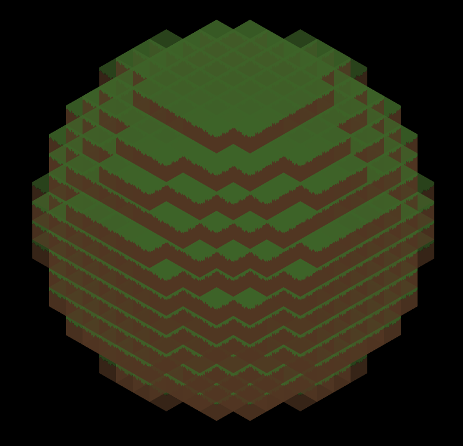

# blocker-d2d
## Usage:
```javascript
app.SetBlock(x, y, z, index);
```

- 0 - Air
- 1 - Stone
- 2 - Grass
- 3 - Dirt
- 4 - Cobblestone
- 5 - Planks
- 6 - Brick

## Block class:

```javascript
const block = CreateBlock(app.parentElement);
block.SetBlock(index);
block.SetPosition(x, y, z); // position inside grid mapped blocks
```

## Preview Sphere 64x64x64

Note: current version generate 16x16x16, if you want bigger sphere, just:
```javascript
app.blocks.count = { x: 64, y: 64, z: 64 };
```

**Example:**
```javascript
for (let z = 0; z < cz; z++) {
  for (let y = 0; y < cy; y++) {
    for (let x = 0; x < cx; x++) {
      const dx = x - cx * 0.5;
      const dy = y - cy * 0.5;
      const dz = z - cz * 0.5;
      const avg = (cx + cy + cz) / 3 * 0.5;
      const distance = Math.sqrt(dx * dx + dy * dy + dz * dz);
      app.SetBlock(
        x, y, z, 
        (distance < avg ? 2 + Math.floor(Math.random() * 0) : 0)
      );
    }
  }
}
```

